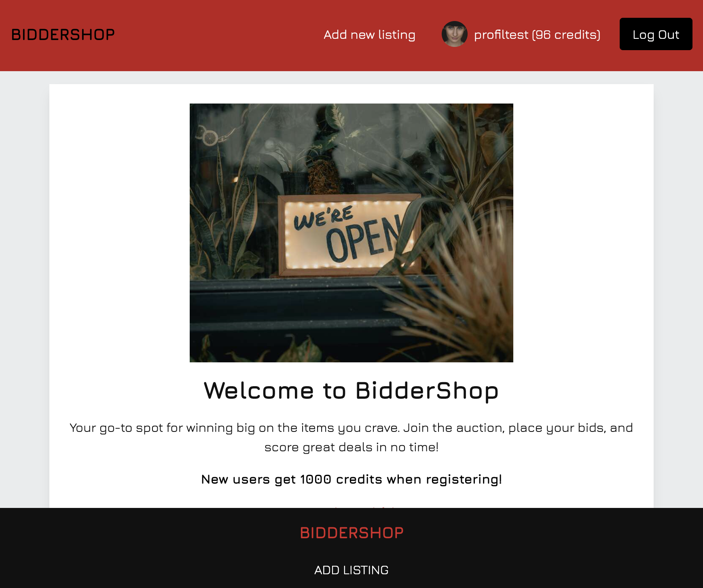

# Biddershop 




This is my Semester Project 2 submission, an online auction marketplace called **Biddershop**. It allows users to browse, bid, and sell things while maintaining a simple, user-friendly interface. Upon registering, users are given 1000 credits to start bidding on the platform.

## Features:

- Unregistered users can search and view all listings.
- Registered users can log in or log out, and update their profile avatar.
- Registered users can create a listing with title, deadline, gallery, and description.
- Users can bid on listings created by others.
- All users can view the bids made on any active listing.
- Listings with expired deadlines are automatically marked as "ended."


## Project Planning:

- I used Trello to track tasks and progress.
- A Notion Gantt chart was used to manage the timeline and ensure the project stayed on track.

## Design:

- Design and prototypes were created in Figma.
- The design focuses on ease of use and clear navigation.

## Reflections:

During development, I faced challenges, particularly with implementing infinite scrolling to load more listings as users scroll. This required multiple fixes, and I learned valuable lessons about structuring infinite scroll implementations for future projects. 

I’m happy with the outcome of **Biddershop** and am fully aware of areas for improvement, such as setting up a more structured error system next time. I appreciate the learning experience and am excited to apply this knowledge to future projects.

## Environment Setup:

This project was built with the following:

- Vite (bundler)
- TailwindCSS
- PostCSS
- Prettier (for code formatting)
- Eslint (for linting)
- Jest (unit testing)
- Cypress (end-to-end testing)

## Getting Started:

### Installation:

1. Clone the repository:

```
git clone git@github.com:RamonaXR/Semester-Project-2.git
```

2. Install the dependencies:

```
npm install
```

### Running

To run the app, run the following commands:

```
npm run dev
```

## Testing 

- Repository has been configured with cypress and jest, and is ready for future testers. 
- To run test, run:

```
npm run test
```

## Linkedin 

- Ramona Jensen
  [My LinkedIn page](www.linkedin.com/in/ramona-jensen-9994362b8)