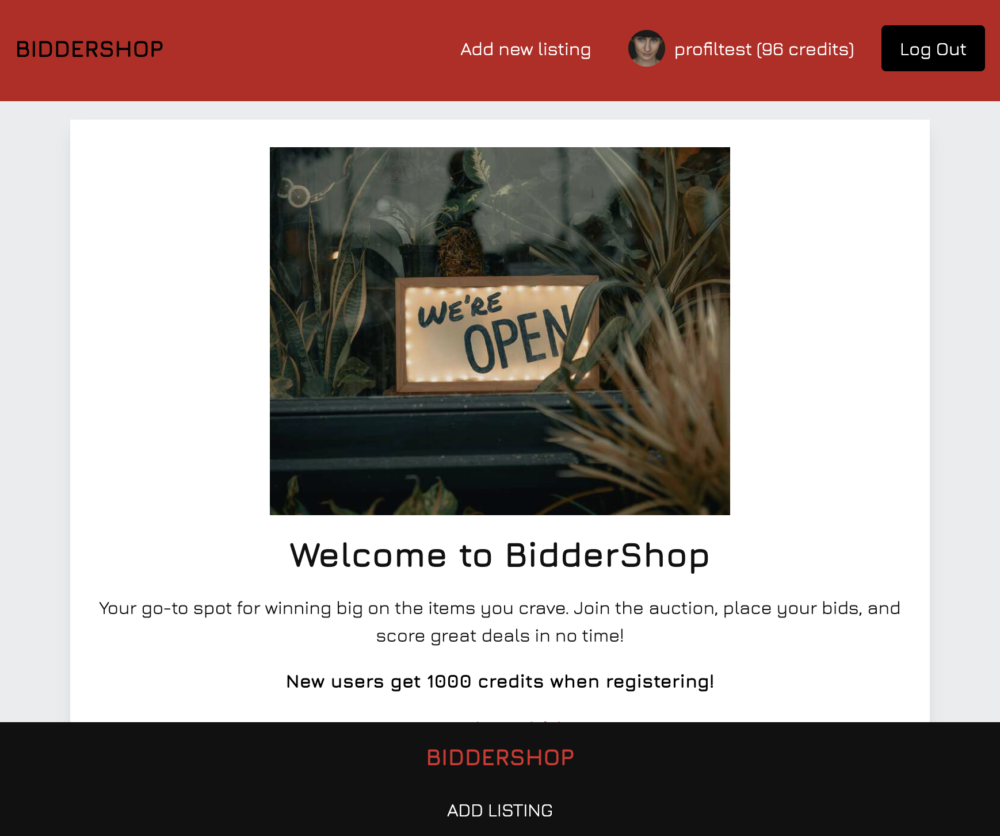

# Biddershop



Biddershop is an online auction marketplace that allows users to browse, bid, and sell items via a simple, user-friendly interface. Registered users begin with 1000 credits to start bidding.

## Table of Contents

- [Features](#features)
- [Project Planning](#project-planning)
- [Design](#design)
- [Tech Stack](#tech-stack)
- [Reflections](#reflections)
- [Installation](#installation)
- [Running](#running)
- [Testing](#testing)
- [LinkedIn](#linkedin)

## Features

- **Browsing:** Unregistered users can search and view all listings.
- **User Accounts:** Registered users can log in/out and update their profile avatar.
- **Listing Creation:** Registered users can create listings with title, deadline, gallery, and description.
- **Bidding:** Users can bid on listings created by others.
- **Bid Visibility:** All users can view bids on active listings.
- **Auto-Ending:** Listings are automatically marked as "ended" when deadlines expire.

## Project Planning

- **Task Management:** Utilized Trello for tracking tasks and progress.
- **Timeline:** Managed with a Notion Gantt chart to keep the project on track.

## Design

- **Prototyping:** All design prototypes were created in Figma.
- **Focus:** The design emphasizes ease of use and clear navigation.

## Tech Stack

- **Bundler:** Vite
- **Styling:** TailwindCSS, PostCSS
- **Code Formatting & Linting:** Prettier, ESLint
- **Testing:** Jest (unit testing) and Cypress (end-to-end testing)

## Reflections

Developing Biddershop presented several challenges, particularly with implementing infinite scrolling for listings. These challenges provided valuable insights on handling dynamic content loading and error management, lessons I plan to apply to future projects.

### Installation:

1. Clone the repository:

```
git clone git@github.com:RamonaXR/Semester-Project-2.git
```

2. Install the dependencies:

```
npm install
```

### Running

To run the app, run the following commands:

```
npm run dev
```

## Testing

- Repository has been configured with cypress and jest, and is ready for future testers.
- To run test, run:

```
npm run test
```

## Linkedin

- Ramona Jensen
  [My LinkedIn page](www.linkedin.com/in/ramona-jensen-9994362b8)
